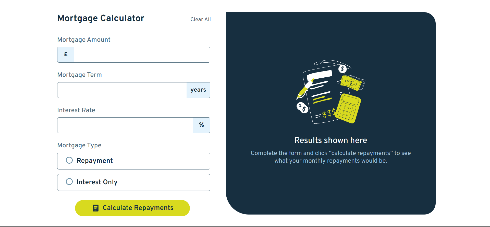

# Frontend Mentor - Mortgage repayment calculator solution

This is a solution to the [Mortgage repayment calculator challenge on Frontend Mentor](https://www.frontendmentor.io/challenges/mortgage-repayment-calculator-Galx1LXK73). Frontend Mentor challenges help you improve your coding skills by building realistic projects. 

## Table of contents

- [Overview](#overview)
  - [The challenge](#the-challenge)
  - [Screenshot](#screenshot)
  - [Links](#links)
- [My process](#my-process)
  - [Built with](#built-with)
  - [What I learned](#what-i-learned)
  - [Continued development](#continued-development)
- [Author](#author)

## Overview

### The challenge

Users should be able to:

- Input mortgage information and see monthly repayment and total repayment amounts after submitting the form
- See form validation messages if any field is incomplete
- Complete the form only using their keyboard
- View the optimal layout for the interface depending on their device's screen size
- See hover and focus states for all interactive elements on the page

### Screenshot



### Links

- [Solution URL](https://www.frontendmentor.io/solutions/mortgage-repayment-calculator-react-nwHzMJxBfw)
- [Live Site URL](https://mortfront.netlify.app/)

## My process

I went with React for this project, and I also followed the mobile-first workflow. 

I divided the layout into three major or main components:
- `main-component`
- `empty-results-component`
- `final-results-component`

In `main-component`, I created 10 components (which I think are a lot by the way, but I did not want to risk jamming everything together and getting stuck later on). each component would play a role both in the design part and the functional part:
`Calculator.jsx`:
```jsx
import Header from "./Header"
import MortgageInputs from "./MortgageInputs"
import CalculateButton from "./CalculateButton"
const Calculator = () => {
  return (
    <div className="calculator-component">
      <Header />
      <MortgageInputs />
      <CalculateButton />
    </div>
  )
}
export default Calculator
``` 

In `empty-results-component`, I created 4 components:
- `Results.jsx`
- `IllustrationEmpty.jsx` (just an svg react component)
- `Text.jsx`
- `Top.jsx`
`Results.jsx`:
```jsx
import Top from "./Top"
import Text from "./Text"
const Results = () => {
  return (
    <div className="empty-results-component">
      <Top />
      <Text />
    </div>
  )
}
export default Results
```

In `final-results-component`, the results of the calculations would appear. I created 6 components:
- `FinalResults.jsx`
- `FinalHeader.jsx`
- `TextComponent.jsx`
- `FinalCalculations.jsx`
- `MonthlyRepayment.jsx`
- `TotalRepayment.jsx`

For the logic part of this project, I initialized 6 states with their corresponding state updater functions in `App.jsx`;
```jsx
const [amount, setAmount] = useState("");
const [term, setTerm] = useState("");
const [rate, setRate] = useState("");
const [morgType, setMorgType] = useState("");
const [showResults, setShowResults] = useState(false);
const [clearAll, setClearAll] = useState(false);
```
Then I passed them to their appropriate components:
```jsx
<Calculator 
  amount={amount} setAmount={setAmount} 
  term={term} setTerm={setTerm}
  rate={rate} setRate={setRate}
  morgType={morgType} setMorgType={setMorgType}
  setShowResults={setShowResults}
  clearAll={clearAll} setClearAll={setClearAll}
/>
<FinalResults 
  amount={amount} term={term} rate={rate} 
  morgType={morgType}
/> 
```
After that, I handled the calculations in `FinalCalculations.jsx` and passed the results to both `MonthlyRepayment.jsx` and `TotalRepayment.jsx` to display them.

I handled the `Clear All` button this way:
`App.jsx`:
```jsx
const [clearAll, setClearAll] = useState(false);
const handleClearAll = () => {
  setAmount("");
  setTerm("");
  setRate("");
  setMorgType("");
  setClearAll(false);
};

if (clearAll) {
  handleClearAll();
}
```
`Header.jsx`:
```jsx
const Header = ({clearAll, setClearAll}) => {
  
  const handleClickAll = () => {
    setClearAll(true);
  }  
  return (
    <header className="header-component">
      <h1 className="header-title">Mortgage Calculator</h1>
      <p onClick={handleClickAll} id="clear-all" className="clear-all-button">Clear All</p>
    </header>
  )
}
export default Header
```

Like I mentioned before, I followed the mobile-first approach for this project, I faced a lot of difficulties trying to make it responsive for larger screens, the project is now in the best shape I could get it.

There's also another issue that has to do with how React 'reacts' to changes in states, each time a state is changed, React automatically re-renders the UI with the new updated states, this causes the `Calculate Repayments` button to be useless beyond the first click, so the user has to refresh the page.

### Built with

- Semantic HTML5 markup
- CSS custom properties
- Flexbox
- Mobile-first workflow
- [React](https://reactjs.org/) - JS library

### What I learned

`:focus-within`: This pseudo-class applies to the parent container when any of its child elements is focused.

```css
.currency-input:focus-within .currency-symbol {
  background-color: var(--Lime);
  transition: all 0.3s ease-in-out;
}
```

### Continued development

This project was a great way for me to demonstrate and assess my knowledge of React, as well as a valuable practice opportunity. My current goal is to improve development efficiency and incorporate Tailwind CSS into future projects.

## Author

- GitHub - [ziad-rima](https://github.com/ziad-rima)
- Frontend Mentor - [@ziad-rima](https://www.frontendmentor.io/profile/ziad-rima)
- X - [@rima](https://x.com/rima4082)

